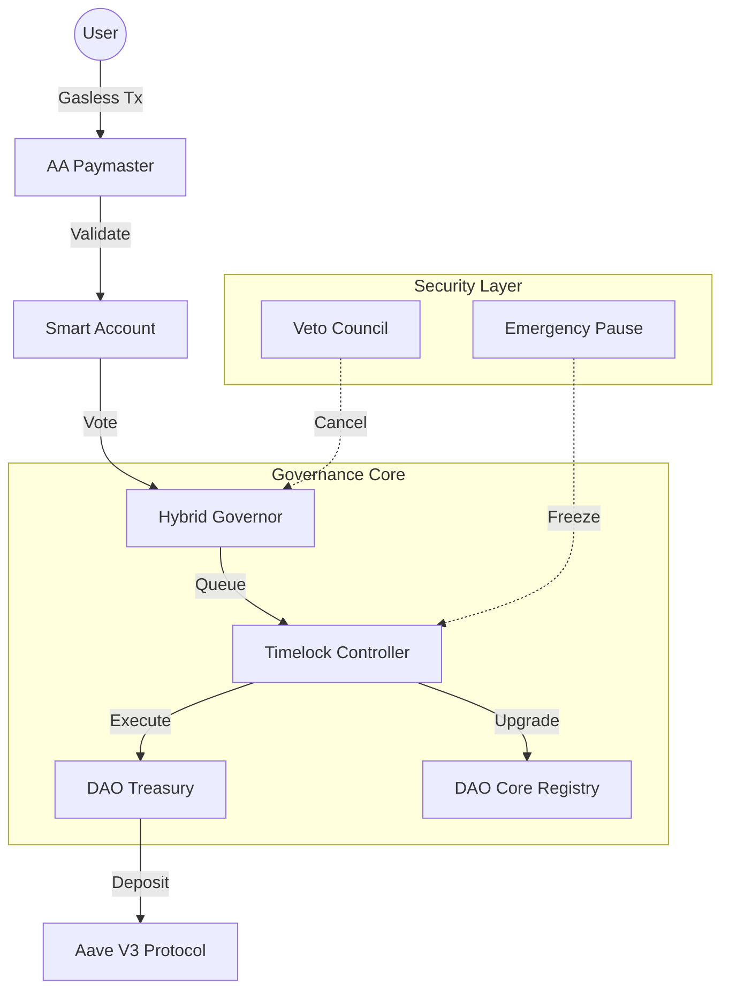

# <h1 align="center">🛡️ Sentinel DAO</h1>

<p align="center">
  <a href="https://getfoundry.sh/">
    
  </a>
  <a href="https://opensource.org/licenses/MIT">
    
  </a>
  <a href="https://sepolia.etherscan.io/">
    
  </a>
  <a href="https://twitter.com/itZ_AmiT0">
    
  </a>
</p>

<p align="center">
  <strong>A modular, protocol-level governance infrastructure designed for long-term institutional control.</strong>
</p>

---

**Sentinel DAO** is not a UI-driven product; it is a rigorous governance framework. It is engineered to control treasury assets, protocol upgrades, and system parameters through enforced execution rules. The architecture strictly separates state from logic, ensuring that complex voting strategies cannot compromise the security of the treasury.

Recently upgraded to include **Account Abstraction (ERC-4337)**, Sentinel DAO now supports frictionless, gasless participation while maintaining immutable on-chain security.

[View Deployed Contracts](#deployed-contracts) • [System Architecture](#system-architecture) • [Educational Resources](#educational-resources)

---

## 📑 Table of Contents

1.  [**Architecture Overview**](#architecture-overview)
2.  [**Design Philosophy**](#design-philosophy)
3.  [**System Architecture**](#system-architecture)
4.  [**Architectural Topology**](#architectural-topology)
5.  [**Core Modules & Functionality**](#core-modules)
6.  [**Testing & Quality Assurance**](#testing)
7.  [**Deployed Contracts**](#deployed-contracts)
8.  [**Engineering Standards**](#engineering-standards)
9.  [**Installation & Setup**](#installation)
10. [**Educational Resources**](#educational-resources)
11. [**Disclaimer**](#disclaimer)

---

## <a id="architecture-overview"></a>🏛️ Architecture Overview

The following diagram illustrates the high-level data flow within the Sentinel DAO protocol, showing how user actions flow through the Account Abstraction layer into the Governance Core.



---

## <a id="design-philosophy"></a>🧠 Design Philosophy

Sentinel DAO approaches governance as "Critical Infrastructure Engineering." It addresses specific failure modes observed in earlier DAO generations:

* **No Implicit Power:** The architecture follows a strict separation of concerns. No contract possesses implicit power over another, and no privileged role (including Admins) can bypass the `TimelockController`.
* **Enforced Delays:** All state-changing proposals execute exclusively through a Timelock. This creates a transparent delay window, ensuring no governance decision is applied instantly, giving stakeholders time to react.
* **Governance as an OS:** The system is designed to be the "Operating System" for an organization. Modules (like Voting Strategies or Yield Engines) can be swapped or upgraded without migrating the underlying asset-holding contracts.

---

## <a id="system-architecture"></a>🏛️ System Architecture

The system is anchored by a **Hybrid Governor**. While it leverages OpenZeppelin's battle-tested foundation, it is strictly modular. Unlike monolithic DAOs, the Voting Logic, Execution, Treasury Control, and User Onboarding (AA) are isolated into separate components. This ensures that complex voting strategies cannot accidentally bypass treasury security boundaries.

---

## <a id="architectural-topology"></a>📂 Architectural Topology

The codebase is organized into logical domains. Instead of a monolithic structure, we separate the **Kernel** (State) from the **Plugins** (Logic).

```text
src/contracts
├── core/                # THE KERNEL (Registry, Timelock, Treasury)
├── governance/          # CONSENSUS LAYER (Voting Logic, Tokens, Veto)
├── aa/                  # USER ABSTRACTION (Smart Wallets, Paymaster)
├── security/            # DEFENSE SYSTEMS (Emergency Pause, Analytics, RBAC)
├── treasury/            # ASSET MANAGEMENT (Vaults & Yield Strategies)
├── config/              # DYNAMIC CONFIG (Quorums, Thresholds)
├── delegation/          # DELEGATION (Voting Power Management)
├── offchain/            # BRIDGES (Snapshot X & Oracle Adapters)
└── upgrades/            # LIFECYCLE (UUPS Proxy Management)

```

---

## <a id="core-modules"></a>🧩 Core Modules & Functionality

### 1. Kernel & Configuration

The "Brain" of the DAO. These contracts manage permissions and system parameters.

* **`DAOCore` (Registry):** Acts as the central source of truth. It maintains the registry of all active modules. If a contract is not registered here, it is not part of the DAO.
* **`RoleManager` (RBAC):** Implements granular Access Control (e.g., `PROPOSER_ROLE`, `GUARDIAN_ROLE`).
* **`DAOConfig`:** Allows the DAO to adjust critical parameters (Voting Period, Quorums) without requiring a full contract upgrade.

### 2. Governance Engines

The system moves beyond simple "1 Token = 1 Vote" mechanics.

* **`HybridGovernorDynamic`:** The central voting engine supporting modular voting strategies.
* **`VotingStrategies`:** Pluggable logic including **Quadratic Voting** (reducing whale dominance) and **Conviction Voting**.
* **`ProposalGuard`:** Anti-spam middleware enforcing reputation checks and cooldown periods.

### 3. Autonomous Treasury

The financial engine designed for active management.

* **`DAOTreasury`:** Supports ETH, ERC-20, ERC-721, and ERC-1155 assets with "Pull-Payment" architecture.
* **`TreasuryYieldStrategy`:** Automatically deposits idle assets into **Aave V3** to generate yield.

### 4. Account Abstraction (ERC-4337)

A newly integrated layer for abstracting blockchain complexity.

* **`DAOAccountFactory`:** Deploys deterministic Smart Accounts for users.
* **`DAOPayMaster`:** Sponsors gas fees, enabling a **Gasless Voting** experience.
* **`SessionKeyModule`:** Implements temporary, scoped permissions (e.g., "Valid for 12 hours") for a frictionless UX.

### 5. Sentinel Security Layer

Active defense mechanisms.

* **`VetoCouncil`:** A specialized multisig that can cancel malicious proposals *before* execution.
* **`EmergencyPause`:** A circuit breaker that freezes the protocol in case of an exploit.
* **`RageQuit`:** Allows dissenters to burn tokens and withdraw their share of assets if a malicious proposal passes.

---

## <a id="testing"></a>🧪 Testing & Quality Assurance

The system has undergone a rigorous multi-layered testing strategy using the Foundry framework, executing over **160+ tests** with zero failures.

### 🛠️ Test Methodology

1. **Unit Tests:** Isolated testing of individual functions (e.g., `test_DepositERC20`) to ensure atomic logic correctness.
2. **Integration Tests:** Validating the interaction between modules (e.g., `DAOIntegration_Lifecycle` validates the full flow from Proposal -> Vote -> Queue -> Execute).
3. **Fuzz Testing:** Using property-based testing to throw random data at the system.
* *Result:* `testFuzz_EndToEndChaos` passed with 256 runs, simulating complex, high-entropy system states.
* *Result:* `testFuzz_RageQuitMath` verified mathematical solvency under various economic conditions.


4. **Security Tests:** Specific test suites ensure that access controls cannot be bypassed and the Core locks down correctly.

---

## <a id="deployed-contracts"></a>✅ Deployed Contracts (Verified)

All contracts have been deployed and verified on the **Sepolia Testnet**.

| Module | Contract Name | Verified Address | Status |
| --- | --- | --- | --- |
| **Core** | **DAO Registry** | [0xf4ffd...8cf6](https://www.google.com/search?q=https://sepolia.etherscan.io/address/0xf4ffd6558454c60E50ef97799C3D69758CB68cf6) | ✅ Verified |
| **Core** | **Timelock Controller** | [0xC4c57...6FCd](https://www.google.com/search?q=https://sepolia.etherscan.io/address/0xC4c57946dE2b9b585d05D21423Eee82501466FCd) | ✅ Verified |
| **Core** | **Treasury Vault** | [0xE1131...1A4E](https://www.google.com/search?q=https://sepolia.etherscan.io/address/0xE113199AE42eF5E9df14a455a67ACC26C8901A4E) | ✅ Verified |
| **Gov** | **Hybrid Governor** | [0x24BC3...CAD3](https://www.google.com/search?q=https://sepolia.etherscan.io/address/0x24BC3F0e1D0e8732Ce30fbf07EF36beCC9a9CAD3) | ✅ Verified |
| **Gov** | **Governance Token** | [0x7F787...ec1DB](https://www.google.com/search?q=https://sepolia.etherscan.io/address/0x7F78740d138edEBC17334217b927F5c4D50ec1DB) | ✅ Verified |
| **Gov** | **Proposal Guard** | [0xC4015...C3bE](https://www.google.com/search?q=https://sepolia.etherscan.io/address/0xC4015518192B3f86bF9F27DDeBEd253267D9C3bE) | ✅ Verified |
| **Sec** | **Veto Council** | [0x4Abd1...tnfh](https://www.google.com/search?q=https://sepolia.etherscan.io/address/0x4Abd12fAED0eabc8cC7825b503EB2B853C8a5278) | ✅ Verified |
| **Sec** | **Emergency Pause** | [0x54078...Ba96](https://www.google.com/search?q=https://sepolia.etherscan.io/address/0x5407869765C92dA9c3B039979170aaBFFaB3Ba96) | ✅ Verified |
| **Sec** | **Rage Quit** | [0x2c26e...44a2](https://www.google.com/search?q=https://sepolia.etherscan.io/address/0x2c26e0b0BdA62434aA4e694a767cF2643C7b44a2) | ✅ Verified |
| **Fi** | **Yield Strategy** | [0x843ab...b524](https://www.google.com/search?q=https://sepolia.etherscan.io/address/0x843abAd0B13436b93E7ab71e075bED679586b524) | ✅ Verified |
| **AA** | **Account Factory** | [0x7B587...9E96e](https://www.google.com/search?q=https://sepolia.etherscan.io/address/0x7B587a4A5F571486f4A8dc1bd6aDB745F71fE96e) | ✅ Verified |
| **AA** | **Gasless Paymaster** | [0x6927f...E9cD](https://www.google.com/search?q=https://sepolia.etherscan.io/address/0x6927fc2B44008b5D05611194d47fa3451f9fE9cD) | ✅ Verified |
| **Off** | **Offchain Executor** | [0x3a40D...996F](https://www.google.com/search?q=https://sepolia.etherscan.io/address/0x3a40D29433453e241415f822364Afdf0a7d5996F) | ✅ Verified |
| **Off** | **Delegation Registry** | [0x891ad...6B68](https://www.google.com/search?q=https://sepolia.etherscan.io/address/0x891addA9FfC646e5CB67015F5F6e667741b76B68) | ✅ Verified |
| **Adv** | **Quadratic Funding** | [0xFb045...b198](https://www.google.com/search?q=https://sepolia.etherscan.io/address/0xFb0455c92908b57c978Fe4B7BE9D1f870B58b198) | ✅ Verified |

---

## <a id="engineering-standards"></a>⚙️ Engineering Standards

This codebase adheres to production-grade Solidity practices:

* **Gas Optimization:** Usage of custom errors (`error Unauthorized()`), `unchecked` blocks, and storage packing.
* **Explicit Access Control:** No "god mode" EOA admins. Every function is guarded by `RoleManager` or `Timelock`.
* **Upgradeability:** Uses UUPS (Universal Upgradeable Proxy Standard) for the Core and Governor, ensuring longevity.

---

## <a id="installation"></a>🛠️ Installation & Setup

**Prerequisites:** [Foundry Toolchain](https://getfoundry.sh/)

```bash
# 1. Clone the repository
git clone [https://github.com/NexTechArchitect/Sentinel-DAO.git](https://github.com/NexTechArchitect/Sentinel-DAO.git)
cd Sentinel-DAO

# 2. Install Dependencies
forge install

# 3. Build Project
forge build

# 4. Run Tests
# Runs the full suite including Fuzzing
forge test

```

---

## <a id="educational-resources"></a>📚 Educational Resources

If you are new to Protocol Engineering, DAOs, or Account Abstraction, these resources are essential reading to understand the architecture of Sentinel DAO:

* **Foundry Framework:** [The Foundry Book](https://book.getfoundry.sh/) - The bible for Foundry development.
* **Account Abstraction:** [EIP-4337 Documentation](https://eips.ethereum.org/EIPS/eip-4337) - Understanding Gasless transactions and Smart Accounts.
* **Governance Logic:** [OpenZeppelin Governor](https://docs.openzeppelin.com/contracts/4.x/governance) - The foundational logic behind the voting mechanism.
* **Security:** [Smart Contract Security Best Practices](https://consensys.github.io/smart-contract-best-practices/) - Essential for understanding the security patterns used here.
* **Solidity:** [Solidity by Example](https://solidity-by-example.org/) - Great for understanding syntax and patterns.

---

## <a id="disclaimer"></a>⚠️ Disclaimer

**EDUCATIONAL ARCHITECTURE NOTICE:**

This repository serves as a reference implementation for advanced DAO patterns. While it utilizes production-grade libraries (OpenZeppelin) and verified architectural patterns:

* **Audit Status:** This codebase has NOT undergone a formal security audit.
* **Use at your own risk:** Do not use this code to secure real value on Mainnet without a comprehensive independent review.

---

**Built with ❤️ by NEXTECHARHITECT**
*Senior Smart Contract Developer · Solidity · Foundry · Web3 Engineer*

[GitHub](https://github.com/NexTechArchitect) • [X (Twitter)](https://x.com/itZ_AmiT0)

```

```
