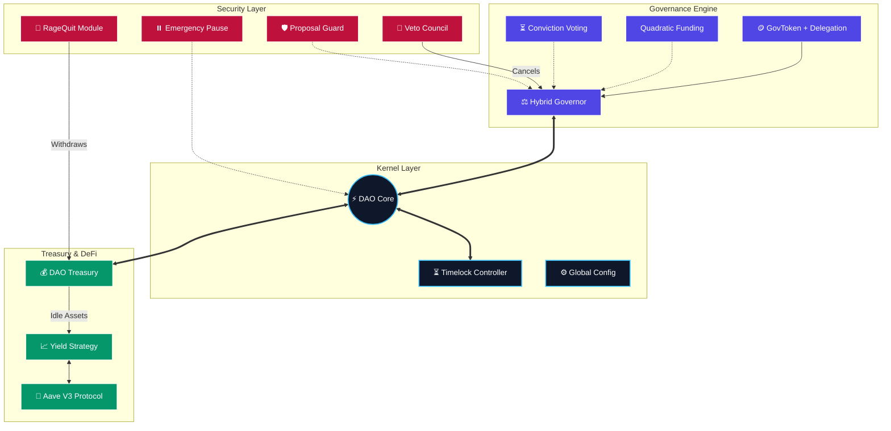

<div align="center">

# 🛡️ Sentinel DAO Protocol

[](https://getfoundry.sh/)
[](https://docs.soliditylang.org/)
[](https://opensource.org/licenses/MIT)
[](https://sepolia.etherscan.io/)
[]()

<br/>

**A protocol-level governance infrastructure designed to model how real decentralized organizations operate under long-term control.**

<p align="center">
  <b>Sentinel DAO</b> is not a demo or a UI-driven product. It is a rigorous governance framework capable of controlling <br/>
  treasury assets, protocol upgrades, and system parameters through enforced execution rules.
</p>

[View Deployed Contracts](#-deployed-contracts-verified) • [Design Philosophy](#-design-philosophy) • [Engineering Standards](#-engineering--development-standards)

</div>

---

## 📑 Table of Contents

- [🧠 Design Philosophy](#-design-philosophy)
- [🏛️ System Architecture](#️-system-architecture)
- [📂 Architectural Topology](#-architectural-topology)
- [🧩 Core Modules & Functionality](#-core-modules--functionality)
- [✅ Deployed Contracts (Verified)](#-deployed-contracts-verified)
- [⚙️ Engineering Standards](#-engineering--development-standards)
- [🛠️ Installation & Setup](#️-installation--setup)
- [⚠️ Disclaimer](#️-disclaimer)

---

## 🧠 Design Philosophy

Sentinel DAO reflects **protocol engineering** rather than simple application development. It addresses real governance failure modes, long-term maintainability, and security isolation.

1.  **No Implicit Power:** The architecture follows a strict separation of power. No contract has implicit power over another, and no privileged role can bypass governance execution.
2.  **Enforced Delays:** All successful proposals execute exclusively through a **Timelock Controller**. This creates a transparent delay window, ensuring no governance decision is applied instantly.
3.  **Governance as Infrastructure:** This system is designed to be extended, audited, and integrated. It serves as the "Operating System" for an organization, not just a voting booth.

---

## 🏛️ System Architecture

The system is anchored by a **Hybrid Governor**. While it leverages OpenZeppelin's battle-tested foundation, I engineered it to be strictly modular. Unlike monolithic DAOs, here the **Voting Logic**, **Execution**, and **Treasury Control** are isolated into separate components. This ensures that complex voting strategies cannot accidentally bypass treasury security boundaries.



---

## 📂 Architectural Topology

The codebase is organized into logical domains, strictly separating **Kernel Logic** from **Pluggable Modules**. This ensures that governance strategies can evolve without destabilizing the core treasury or security layers.

```text
src/contracts
├── core
    THE KERNEL & STATE
    Holds the immutable registry, the Time-locked execution engine,
    and the Multi-asset Treasury vault
    
├── governance
    CONSENSUS ENGINES
    Contains pluggable voting strategies like Quadratic Funding and Conviction Voting
    along with Optimistic Security modules
    
├── security
    SENTINEL DEFENSE LAYER
    Active defense systems including Circuit Breakers, On-chain Analytics,
    and Role-Based Access Control
    
├── delegation
    META-GOVERNANCE
    Logic for gasless interaction and EIP-712 signature-based
    voting power delegation
    
├── offchain
    HYBRID BRIDGE
    Oracle adapters that verify off-chain signals to trigger
    on-chain execution
    
├── config
    DYNAMIC TUNING
    Manages mutable system parameters allowing the DAO to self-optimize
    without code upgrades
    
├── upgrades
    LIFECYCLE MANAGEMENT
    UUPS Proxy implementations and secure upgrade paths to ensure
    protocol longevity
    
└── utils
    CRYPTOGRAPHIC PRIMITIVES
    Low-level helpers for signature verification and data formatting

```

---

## 🧩 Core Modules & Functionality

### 🔹 The Governance Kernel

* **Hybrid Governor:** Voting strategies are not hardcoded. Proposals can be executed under token-weighted, quadratic, or conviction-based models.
* **Timelock Controller:** Acts as the final source of truth. Funds cannot be moved and upgrades cannot happen without passing through the Timelock delay.
* **Role Manager:** Permissions are not scattered. Administrative authority is explicitly defined, auditable, and revocable.

### 🔹 Security & Protection

* **RageQuit Mechanism:** Enforces accountability. If governance becomes hostile, token holders can burn their tokens and exit with a proportional share of assets, preventing permanent lock-in.
* **Emergency Pause:** Governed by Guardians, this system is **time-bounded**. It automatically expires after a fixed duration, preventing permanent freezes or hidden backdoors.
* **Anti-Spam:** Proposal submission is protected through reputation checks and cooldown windows to prevent governance flooding.

### 🔹 Autonomous Treasury

* **Custody Rules:** Funds cannot be moved by admins directly. Transfers are possible *only* through Timelock execution or the RageQuit mechanism.
* **Multi-Asset Vault:** Capable of holding ETH, ERC20, ERC721, and ERC1155 tokens.
* **DeFi Integration:** Idle assets are programmatically deployed to Aave V3 via `TreasuryYieldStrategy`, turning the treasury into an active participant.

### 🔹 Hybrid Compatibility

* **Off-Chain Bridge:** Snapshot-style voting results can be verified through **EIP-712 signatures** and executed on-chain without trusting centralized servers.
* **Analytics:** Proposal outcomes and activity metrics are recorded on-chain to support long-term health monitoring.

---

## ✅ Deployed Contracts (Verified)

All contracts have been deployed and fully verified on the **Sepolia Testnet**.

| Module | Contract Name | Verified Address | Status |
| --- | --- | --- | --- |
| **Core** | **DAO Core Registry** | [`0xf4ffd...8cf6`](https://sepolia.etherscan.io/address/0xf4ffd6558454c60E50ef97799C3D69758CB68cf6) | ✅ Verified |
|  | **Timelock Controller** | [`0xC4c57...6FCd`](https://sepolia.etherscan.io/address/0xC4c57946dE2b9b585d05D21423Eee82501466FCd) | ✅ Verified |
| **Gov** | **Governance Token** | [`0x7F787...ec1DB`](https://sepolia.etherscan.io/address/0x7F78740d138edEBC17334217b927F5c4D50ec1DB) | ✅ Verified |
|  | **Hybrid Governor** | [`0x24BC3...CAD3`](https://sepolia.etherscan.io/address/0x24BC3F0e1D0e8732Ce30fbf07EF36beCC9a9CAD3) | ✅ Verified |
|  | **Veto Council** | [`0x4Abd1...tnfh`](https://sepolia.etherscan.io/address/0x4Abd12fAED0eabc8cC7825b503EB2B853C8a5278) | ✅ Verified |
| **Fi** | **DAO Treasury** | [`0xE1131...1A4E`](https://sepolia.etherscan.io/address/0xE113199AE42eF5E9df14a455a67ACC26C8901A4E) | ✅ Verified |
| **Sec** | **Proposal Guard** | [`0xC4015...C3bE`](https://sepolia.etherscan.io/address/0xC4015518192B3f86bF9F27DDeBEd253267D9C3bE) | ✅ Verified |
|  | **Rage Quit** | [`0x2c26e...44a2`](https://sepolia.etherscan.io/address/0x2c26e0b0BdA62434aA4e694a767cF2643C7b44a2) | ✅ Verified |
| **Adv** | **Quadratic Funding** | [`0xFb045...b198`](https://sepolia.etherscan.io/address/0xFb0455c92908b57c978Fe4B7BE9D1f870B58b198) | ✅ Verified |

---

## ⚙️ Engineering & Development Standards

This codebase represents an advanced smart contract implementation adhering to production-grade standards:

* **Gas-Aware Design:** Usage of custom errors and storage packing.
* **Explicit Access Checks:** Every sensitive function is guarded by RoleManager or Timelock.
* **Testing Rigor:** The system is covered by extensive unit tests, integration tests, fuzz testing, and system-level lifecycle simulations.
* **Separation of Concerns:** Role management, logic, and storage are decoupled to ensure upgradeability without data loss.

---

## 🛠️ Installation & Setup

**Prerequisites:** [Foundry Toolchain](https://getfoundry.sh/)

```bash
# 1. Clone the repository
git clone [https://github.com/NexTechArchitect/Sentinel-DAO.git](https://github.com/NexTechArchitect/Sentinel-DAO.git)
cd Sentinel-DAO

# 2. Install Dependencies
forge install

# 3. Build Project
make build

```

---

## ⚠️ Disclaimer

**EDUCATIONAL ARCHITECTURE NOTICE:**

This repository serves as a reference implementation for advanced DAO patterns. While it utilizes production-grade libraries (OpenZeppelin) and verified architectural patterns:

1. **Audit Status:** This codebase has **NOT** undergone a formal security audit.
2. **Use at your own risk:** Do not use this code to secure real value on Mainnet without a comprehensive review.

---
<div align="center"> <b>Built with ❤️ by NEXTECHARHITECT</b>


<i>Senior Smart Contract Developer · Solidity · Foundry · Web3 Engineer</i>


<a href="https://github.com/NexTechArchitect">GitHub</a> • <a href="https://www.google.com/url?sa=E&source=gmail&q=https://x.com/itZ_AmiT0">Twitter</a> </div>
